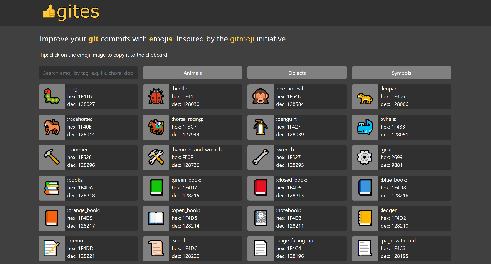

## 📃 About

📖 gites -- (🇵🇱 *Polish, colloquial*) super, extra, great, excellent, wonderful

👍[**gites**](https://sokolak.wixsite.com/gites) is an emoji repository that can help you to highlight purpose or intent of your [git](https://git-scm.com/) commits. The project inspired by the [gitmoji](https://gitmoji.dev/) initiative.

## ⚙️ Technologies

| Backend 🗄️                                                  | Frontend 🖼️                                   |
| :--------------------------------------------------------- | :------------------------------------------- |
| [Java 8+](https://openjdk.java.net/projects/jdk/16/)       | [JavaScript](https://www.javascript.com/)    |
| [SpringBoot 2.4.5](https://spring.io/projects/spring-boot) | [Angular 1.8.2](https://angular.io/)         |
| [Hibernate](https://hibernate.org/)                        | [Bootstrap 5.0.0](https://getbootstrap.com/) |
| [PostgreSQL](https://www.postgresql.org/)                  |                                              |
| [H2](https://www.h2database.com/html/main.html)            |                                              |

## 🛠️️ Installation

0. Install [NodeJS](https://nodejs.org/en/) and [Bower](https://Bower.io/)
1. Go to `gites\src\main\resources\static`
2. Run `bower update` in the command line
3. Open, build and run the `GitesApplication` Java project

## 🔌 REST API

👍**gites** exposes the REST API with the following JSON endpoints (the default port is 8080):

| Endpoint 🟢                                    | Description 📝                                                |
| :-------------------------------------------- | :----------------------------------------------------------- |
| `/api/emojis`                                 | get all emojis                                               |
| `/api/emojis/{name}`                          | get the emoji named `{name}`                                 |
| `/api/emojis?tag={phrase1}&tag={phrase2}&...` | get emojis whose tag list contains the phrases `{phrase1}`, `{phrase2}`... |
| `/api/tags`                                   | get all emoji tags                                           |
| `/api/tags/{name}`                            | get the emoji tag named `{name}`                             |
| `/api/status`                            		| returns code 200 if the application is running               |